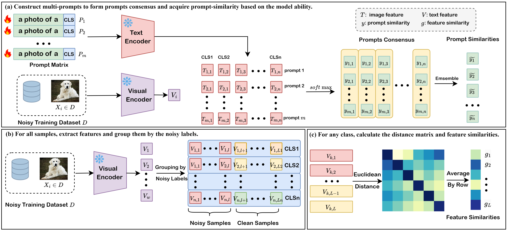

# Robust Similarity from Vision-Language Models for Learning with Noisy Labels

## Datasets

Please follow [CoOp Datasets Instructions](https://github.com/KaiyangZhou/CoOp/blob/main/DATASETS.md) to install the datasets.

## How to run
### Requirements
Only for the purpose of verifying the model principles, we just used one GPU: RTX 2080-Ti and trained the prompt learner. The following codes is my constructed shell codes for running only once.

+ Screen 0
```bash
screen -S cuda0
cd scripts
bash train_exp0.sh ssdtd
```

### Shell Codes
We configure all experiments in a shell script so that it's very convenient to conduct _Validation Experiments_ and _Ablation Experiment_. After running experiments, the script immediately did result analysis.
```bash
#!/bin/bash

DATASET=$1
TAG=$2

# Experiments: Training for POMA
# Configuration
# --- dataset: Dtd
# --- prompt blocks m: 1 | 2 | 4 | 6
# --- noise rate: 0 | 12.5% | 25% | 50%
# --- backbone: Text: ViT-B/32-PT, Visual: RN50-PT
CUDA_VISIBLE_DEVICES=0 bash poma_train.sh ${DATASET} rn50_ep50 end 16 16 1 False True rn50_random_init${TAG} 0
CUDA_VISIBLE_DEVICES=0 bash poma_train.sh ${DATASET} rn50_ep50 end 16 16 1 False True rn50_random_init${TAG} 2
CUDA_VISIBLE_DEVICES=0 bash poma_train.sh ${DATASET} rn50_ep50 end 16 16 1 False True rn50_random_init${TAG} 4
CUDA_VISIBLE_DEVICES=0 bash poma_train.sh ${DATASET} rn50_ep50 end 16 16 1 False True rn50_random_init${TAG} 8

CUDA_VISIBLE_DEVICES=0 bash poma_train.sh ${DATASET} rn50_ep50 end 16 16 2 False True rn50_random_init${TAG} 0
CUDA_VISIBLE_DEVICES=0 bash poma_train.sh ${DATASET} rn50_ep50 end 16 16 2 False True rn50_random_init${TAG} 2
CUDA_VISIBLE_DEVICES=0 bash poma_train.sh ${DATASET} rn50_ep50 end 16 16 2 False True rn50_random_init${TAG} 4
CUDA_VISIBLE_DEVICES=0 bash poma_train.sh ${DATASET} rn50_ep50 end 16 16 2 False True rn50_random_init${TAG} 8

CUDA_VISIBLE_DEVICES=0 bash poma_train.sh ${DATASET} rn50_ep50 end 16 16 4 False True rn50_random_init${TAG} 0
CUDA_VISIBLE_DEVICES=0 bash poma_train.sh ${DATASET} rn50_ep50 end 16 16 4 False True rn50_random_init${TAG} 2
CUDA_VISIBLE_DEVICES=0 bash poma_train.sh ${DATASET} rn50_ep50 end 16 16 4 False True rn50_random_init${TAG} 4
CUDA_VISIBLE_DEVICES=0 bash poma_train.sh ${DATASET} rn50_ep50 end 16 16 4 False True rn50_random_init${TAG} 8

CUDA_VISIBLE_DEVICES=0 bash poma_train.sh ${DATASET} rn50_ep50 end 16 16 6 False True rn50_random_init${TAG} 0
CUDA_VISIBLE_DEVICES=0 bash poma_train.sh ${DATASET} rn50_ep50 end 16 16 6 False True rn50_random_init${TAG} 2
CUDA_VISIBLE_DEVICES=0 bash poma_train.sh ${DATASET} rn50_ep50 end 16 16 6 False True rn50_random_init${TAG} 4
CUDA_VISIBLE_DEVICES=0 bash poma_train.sh ${DATASET} rn50_ep50 end 16 16 6 False True rn50_random_init${TAG} 8

# Experiments: Result Analysis for POMA
# Configuration
# --- Experiments: Training for POMA
CUDA_VISIBLE_DEVICES=0 bash parse_test.sh ${DATASET} rn50_ep50 end 16 16 1 False True rn50_random_init${TAG}
CUDA_VISIBLE_DEVICES=0 bash parse_test.sh ${DATASET} rn50_ep50 end 16 16 2 False True rn50_random_init${TAG}
CUDA_VISIBLE_DEVICES=0 bash parse_test.sh ${DATASET} rn50_ep50 end 16 16 4 False True rn50_random_init${TAG}
CUDA_VISIBLE_DEVICES=0 bash parse_test.sh ${DATASET} rn50_ep50 end 16 16 6 False True rn50_random_init${TAG}
```

## Framework


## Results
### Abalation Study for POMA -- prompt blocks
+ dataset: Dtd
+ noise rate: 0 | 12.5% | 25% | 50%
+ backbone: Text: ViT-B/32-PT, Visual: RN50-PT

|Prompt Blocks|Noise Rate|Noise Rate|Noise Rate|Noise Rate|MeanAcc|
|:------:|:------:|:------:|:------:|:------:|:------:|
||0|12.5%|25%|50%||
|PTNL|62.86%|58.90%|53.62%|46.19%|55.39%|
|1| 61.90% +- 1.29% | 59.77% +- 1.02% | 57.68% +- 0.76% | 49.39% +- 0.31% |57.19%|
|2| 62.73% +- 1.00% | 60.92% +- 0.45% | 59.65% +- 1.50% | 49.84% +- 0.89% |58.28%|
|4| 62.80% +- 0.51% | 62.61% +- 0.91% | 60.56% +- 0.41% | 52.40% +- 1.10% |59.59%|
|6| **63.95% +- 0.54%** | **62.77% +- 0.59%** | **61.17% +- 1.02%** | **53.74% +- 1.67%** |**60.41%**|

### Raw Materials
Model traning logs can be found in the `log.txt` under each experiment directory.

Parsing results can be found in the following files:
+ Dataset: Dtd
    + [POMA RN50_EP50_16SHOTS_1BLOCK ON Dtd](./output/ssdtd/POMA/1block_analysis.txt)
    + [POMA RN50_EP50_16SHOTS_2BLOCK ON Dtd](./output/ssdtd/POMA/2block_analysis.txt)
    + [POMA RN50_EP50_16SHOTS_4BLOCK ON Dtd](./output/ssdtd/POMA/4block_analysis.txt)
    + [POMA RN50_EP50_16SHOTS_6BLOCK ON Dtd](./output/ssdtd/POMA/6block_analysis.txt)

## References
+ [CoOp](https://github.com/KaiyangZhou/CoOp)
+ [PTNL](https://github.com/CEWu/PTNL)
