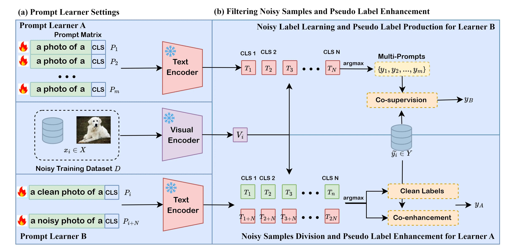

# Double Prompts Learner: Classifer and Discriminator Mechanisms for Noisy Label Learning

## Datasets

Please follow [CoOp Datasets Instructions](https://github.com/KaiyangZhou/CoOp/blob/main/DATASETS.md) to install the datasets.

## How to run
### Requirements
To accelerate training double prompt learners and abalation experinments, we used two GPUs: RTX 2080-Ti and construct the shell codes template for running only once.

+ Screen 0
```bash
screen -S cuda0
cd scripts
bash train_exp0.sh ssdtd
```
+ Screen 1
```bash
screen -S cuda1
cd scripts
bash train_exp1.sh ssdtd
```

### Shell Codes
We configure all experiments in a shell script so that it's very convenient to conduct _Validation Experiments_ and _Ablation Experiment_. After running experiments, the script immediately did result analysis.
```bash
#!/bin/bash

DATASET=$1

# Experiments: Training for DPL
# Configuration
# --- dataset: Dtd
# --- noise rate: 0 | 12.5% | 25% | 50%
# --- backbone: Text: ViT-B/32-PT, Visual: RN50-PT 
CUDA_VISIBLE_DEVICES=0 bash dpl_train.sh ${DATASET} rn50_ep50 end 16 16 4 False True rn50_random_init 0.5 0
CUDA_VISIBLE_DEVICES=0 bash dpl_train.sh ${DATASET} rn50_ep50 end 16 16 4 False True rn50_random_init 0.5 2
CUDA_VISIBLE_DEVICES=0 bash dpl_train.sh ${DATASET} rn50_ep50 end 16 16 4 False True rn50_random_init 0.5 4
CUDA_VISIBLE_DEVICES=0 bash dpl_train.sh ${DATASET} rn50_ep50 end 16 16 4 False True rn50_random_init 0.5 8


# Experiments: Abalation Study for DPL
# Configuration
# --- weight parameter beta: 0.0 | 0.1 | 0.2 | 0.3 | 0.4 | 0.5
# --- dataset: Dtd
# --- noise rate: 0 | 12.5% | 25% | 50%
# --- backbone: Text: ViT-B/32-PT, Visual: RN50-PT
# --- prompt blocks m: 4
CUDA_VISIBLE_DEVICES=0 bash dpl_train.sh ${DATASET} rn50_ep50 end 16 16 4 False True rn50_random_init 0.0 0
CUDA_VISIBLE_DEVICES=0 bash dpl_train.sh ${DATASET} rn50_ep50 end 16 16 4 False True rn50_random_init 0.0 2
CUDA_VISIBLE_DEVICES=0 bash dpl_train.sh ${DATASET} rn50_ep50 end 16 16 4 False True rn50_random_init 0.0 4
CUDA_VISIBLE_DEVICES=0 bash dpl_train.sh ${DATASET} rn50_ep50 end 16 16 4 False True rn50_random_init 0.0 8

CUDA_VISIBLE_DEVICES=0 bash dpl_train.sh ${DATASET} rn50_ep50 end 16 16 4 False True rn50_random_init 0.1 0
CUDA_VISIBLE_DEVICES=0 bash dpl_train.sh ${DATASET} rn50_ep50 end 16 16 4 False True rn50_random_init 0.1 2
CUDA_VISIBLE_DEVICES=0 bash dpl_train.sh ${DATASET} rn50_ep50 end 16 16 4 False True rn50_random_init 0.1 4
CUDA_VISIBLE_DEVICES=0 bash dpl_train.sh ${DATASET} rn50_ep50 end 16 16 4 False True rn50_random_init 0.1 8

CUDA_VISIBLE_DEVICES=0 bash dpl_train.sh ${DATASET} rn50_ep50 end 16 16 4 False True rn50_random_init 0.2 0
CUDA_VISIBLE_DEVICES=0 bash dpl_train.sh ${DATASET} rn50_ep50 end 16 16 4 False True rn50_random_init 0.2 2
CUDA_VISIBLE_DEVICES=0 bash dpl_train.sh ${DATASET} rn50_ep50 end 16 16 4 False True rn50_random_init 0.2 4
CUDA_VISIBLE_DEVICES=0 bash dpl_train.sh ${DATASET} rn50_ep50 end 16 16 4 False True rn50_random_init 0.2 8

CUDA_VISIBLE_DEVICES=0 bash dpl_train.sh ${DATASET} rn50_ep50 end 16 16 4 False True rn50_random_init 0.3 0
CUDA_VISIBLE_DEVICES=0 bash dpl_train.sh ${DATASET} rn50_ep50 end 16 16 4 False True rn50_random_init 0.3 2
CUDA_VISIBLE_DEVICES=0 bash dpl_train.sh ${DATASET} rn50_ep50 end 16 16 4 False True rn50_random_init 0.3 4
CUDA_VISIBLE_DEVICES=0 bash dpl_train.sh ${DATASET} rn50_ep50 end 16 16 4 False True rn50_random_init 0.3 8

CUDA_VISIBLE_DEVICES=0 bash dpl_train.sh ${DATASET} rn50_ep50 end 16 16 4 False True rn50_random_init 0.4 0
CUDA_VISIBLE_DEVICES=0 bash dpl_train.sh ${DATASET} rn50_ep50 end 16 16 4 False True rn50_random_init 0.4 2
CUDA_VISIBLE_DEVICES=0 bash dpl_train.sh ${DATASET} rn50_ep50 end 16 16 4 False True rn50_random_init 0.4 4
CUDA_VISIBLE_DEVICES=0 bash dpl_train.sh ${DATASET} rn50_ep50 end 16 16 4 False True rn50_random_init 0.4 8

CUDA_VISIBLE_DEVICES=0 bash dpl_train.sh ${DATASET} rn50_ep50 end 16 16 4 False True rn50_random_init 0.5 0
CUDA_VISIBLE_DEVICES=0 bash dpl_train.sh ${DATASET} rn50_ep50 end 16 16 4 False True rn50_random_init 0.5 2
CUDA_VISIBLE_DEVICES=0 bash dpl_train.sh ${DATASET} rn50_ep50 end 16 16 4 False True rn50_random_init 0.5 4
CUDA_VISIBLE_DEVICES=0 bash dpl_train.sh ${DATASET} rn50_ep50 end 16 16 4 False True rn50_random_init 0.5 8

# Experiments: Abalation Study for DPL
# Configuration
# --- prompt blocks m: 2 | 4
# --- dataset: Dtd
# --- noise rate: 0 | 12.5% | 25% | 50%
# --- backbone: Text: ViT-B/32-PT, Visual: RN50-PT
# --- weight parameter beta: 0.5
CUDA_VISIBLE_DEVICES=0 bash dpl_train.sh ${DATASET} rn50_ep50 end 16 16 2 False True rn50_random_init 0.5 0
CUDA_VISIBLE_DEVICES=0 bash dpl_train.sh ${DATASET} rn50_ep50 end 16 16 2 False True rn50_random_init 0.5 2
CUDA_VISIBLE_DEVICES=0 bash dpl_train.sh ${DATASET} rn50_ep50 end 16 16 2 False True rn50_random_init 0.5 4
CUDA_VISIBLE_DEVICES=0 bash dpl_train.sh ${DATASET} rn50_ep50 end 16 16 2 False True rn50_random_init 0.5 8

CUDA_VISIBLE_DEVICES=0 bash dpl_train.sh ${DATASET} rn50_ep50 end 16 16 4 False True rn50_random_init 0.5 0
CUDA_VISIBLE_DEVICES=0 bash dpl_train.sh ${DATASET} rn50_ep50 end 16 16 4 False True rn50_random_init 0.5 2
CUDA_VISIBLE_DEVICES=0 bash dpl_train.sh ${DATASET} rn50_ep50 end 16 16 4 False True rn50_random_init 0.5 4
CUDA_VISIBLE_DEVICES=0 bash dpl_train.sh ${DATASET} rn50_ep50 end 16 16 4 False True rn50_random_init 0.5 8

# Experiments: Result Analysis for DPL
# Configuration
# --- Experiments: Training for DPL
CUDA_VISIBLE_DEVICES=0 bash parse_test.sh ${DATASET} rn50_ep50 end 16 16 4 False True rn50_random_init 0.5

# Configuration
# --- Experiments: Abalation Study for DPL -- weight parameter
CUDA_VISIBLE_DEVICES=0 bash parse_test.sh ${DATASET} rn50_ep50 end 16 16 4 False True rn50_random_init 0.0
CUDA_VISIBLE_DEVICES=0 bash parse_test.sh ${DATASET} rn50_ep50 end 16 16 4 False True rn50_random_init 0.1
CUDA_VISIBLE_DEVICES=0 bash parse_test.sh ${DATASET} rn50_ep50 end 16 16 4 False True rn50_random_init 0.2
CUDA_VISIBLE_DEVICES=0 bash parse_test.sh ${DATASET} rn50_ep50 end 16 16 4 False True rn50_random_init 0.3
CUDA_VISIBLE_DEVICES=0 bash parse_test.sh ${DATASET} rn50_ep50 end 16 16 4 False True rn50_random_init 0.4
CUDA_VISIBLE_DEVICES=0 bash parse_test.sh ${DATASET} rn50_ep50 end 16 16 4 False True rn50_random_init 0.5

# Configuration
# --- Experiments: Abalation Study for DPL -- prompt blocks
CUDA_VISIBLE_DEVICES=0 bash parse_test.sh ${DATASET} rn50_ep50 end 16 16 2 False True rn50_random_init 0.5
```

## Framework


## Results
### Abalation Study for DPL -- prompt blocks
+ dataset: Dtd
+ noise rate: 0 | 12.5% | 25% | 50%
+ backbone: Text: ViT-B/32-PT, Visual: RN50-PT
+ weight parameter beta: 0.5

|Prompt Blocks|Noise Rate|Noise Rate|Noise Rate|Noise Rate|
|:------:|:------:|:------:|:------:|:------:|
||0|12.5%|25%|50%|
|PTNL|62.86%|58.90%|53.62%|46.19%|
|1| 63.10% +- 0.83% | **61.58% +- 0.25%** | 60.40% +- 1.40% | 53.65% +- 0.47% |
|2| 63.26% +- 0.60% | 60.78% +- 0.56% | **60.62% +- 0.89%** | 54.59% +- 1.28% |
|4| **63.51% +- 0.94%** | 61.37% +- 0.71% | 59.97% +- 0.88% | **54.73% +- 0.89%** |
|6| 63.06% +- 0.41% | 60.93% +- 0.66% | 59.91% +- 1.06% | 54.43% +- 1.90% |

+ dataset: Caltech101
+ noise rate: 0 | 12.5% | 25% | 50%
+ backbone: Text: ViT-B/32-PT, Visual: RN50-PT
+ weight parameter beta: 0.5

|Prompt Blocks|Noise Rate|Noise Rate|Noise Rate|Noise Rate|MeanAcc|
|:------:|:------:|:------:|:------:|:------:|:------:|
||0|12.5%|25%|50%||
|PTNL|90.65%|82.51%|78.70%|70.13%|80.50%|
|1| 91.33% +- 0.29% | 90.48% +- 0.57% | 88.93% +- 0.17% | 85.37% +- 1.87% | 89.03% |
|2| 91.37% +- 0.17% | 90.82% +- 0.17% | 89.36% +- 0.47% | 84.12% +- 2.33% | 88.92% |
|4| 91.25% +- 0.65% | 90.68% +- 0.14% | 89.16% +- 0.04% | 84.41% +- 2.72% | 88.88% |

### Abalation Study for DPL -- weight parameter
+ dataset: Dtd
+ noise rate: 0 | 12.5% | 25% | 50%
+ backbone: Text: ViT-B/32-PT, Visual: RN50-PT
+ prompt blocks m: 4

|Beta|Noise Rate|Noise Rate|Noise Rate|Noise Rate|MeanAcc|
|:------:|:------:|:------:|:------:|:------:|:------:|
||0|12.5%|25%|50%||
|PTNL|62.86%|58.90%|53.62%|46.19%|55.39%|
|0.0| 62.37% +- 0.36% | 61.21% +- 0.49% | 59.44% +- 2.08% | 53.65% +- 0.98% |59.17%|
|0.1| 62.51% +- 0.41% | 60.96% +- 0.91% | 59.99% +- 1.19% | 53.23% +- 0.93% |59.17%|
|0.2| 63.02% +- 0.27% | 61.17% +- 0.97% | 60.87% +- 0.68% | 53.59% +- 2.33% |59.66%|
|0.3| 62.67% +- 0.41% | 61.15% +- 0.93% | 59.83% +- 1.12% | 55.16% +- 1.40% |59.70%|
|0.4| 63.59% +- 0.77% | 61.39% +- 0.85% | 60.13% +- 0.39% | 55.18% +- 2.15% |**60.07%**|
|0.5| 63.51% +- 0.94% | 61.37% +- 0.71% | 59.97% +- 0.88% | 54.73% +- 0.89% |59.89%|
|0.6| 62.37% +- 0.75% | 61.39% +- 0.98% | 59.89% +- 1.64% | 53.19% +- 1.94% |59.21%|
|0.7| 62.86% +- 0.65% | 61.03% +- 0.77% | 59.95% +- 1.43% | 53.86% +- 0.27% |59.43%|
|0.8| 62.96% +- 0.33% | 60.28% +- 0.90% | 59.93% +- 0.89% | 53.05% +- 3.58% |59.06%|
|0.9| 62.49% +- 0.31% | 61.05% +- 0.33% | 59.48% +- 0.96% | 53.03% +- 1.61% |59.01%|
|1.0| 63.10% +- 0.39% | 60.22% +- 0.48% | 59.18% +- 1.12% | 51.91% +- 2.52% |58.60%|

+ dataset: Caltech101
+ noise rate: 0 | 12.5% | 25% | 50%
+ backbone: Text: ViT-B/32-PT, Visual: RN50-PT
+ prompt blocks m: 4

|Beta|Noise Rate|Noise Rate|Noise Rate|Noise Rate|MeanAcc|
|:------:|:------:|:------:|:------:|:------:|:------:|
||0|12.5%|25%|50%||
|PTNL|90.65%|82.51%|78.70%|70.13%|80.50%|
|0.0| 90.90% +- 0.34% | 90.56% +- 0.29% | 90.17% +- 0.18% | 88.67% +- 0.25% |90.07%|
|0.1| 91.02% +- 0.30% | 90.92% +- 0.11% | 90.29% +- 0.52% | 88.94% +- 0.61% |90.29%|
|0.2| 90.90% +- 0.21% | 90.97% +- 0.28% | 90.24% +- 0.19% | 88.75% +- 0.73% |90.21%|
|0.3| 91.04% +- 0.25% | 90.40% +- 0.15% | 90.01% +- 0.14% | 88.56% +- 0.67% |90.00%|
|0.4| 91.00% +- 0.42% | 90.72% +- 0.18% | 89.93% +- 0.17% | 87.75% +- 0.90% |89.85%|
|0.5| 91.25% +- 0.65% | 90.68% +- 0.14% | 89.16% +- 0.04% | 84.41% +- 2.72% |88.88%|
|0.6| 91.07% +- 0.21% | 90.45% +- 0.30% | 88.63% +- 0.63% | 83.02% +- 2.72% |88.29%|
|0.7| 90.86% +- 0.24% | 90.57% +- 0.30% | 88.69% +- 0.19% | 83.08% +- 3.39% |88.30%|
|0.8| 91.14% +- 0.36% | 90.52% +- 0.29% | 89.55% +- 0.52% | 81.42% +- 1.66% |88.16%|
|0.9| 90.98% +- 0.02% | 90.18% +- 0.59% | 88.92% +- 0.42% | 83.48% +- 1.10% |88.39%|
|1.0| 91.25% +- 0.37% | 90.64% +- 0.30% | 89.24% +- 0.58% | 84.46% +- 0.75% |88.90%|

### Raw Materials
Model traning logs can be found in the `log.txt` under each experiment directory.

Parsing results can be found in the following files:
+ Dataset: Dtd
    + [DPL RN50_EP50_16SHOTS_1BLOCK_0.5BETA ON Dtd](./output/ssdtd/DPL/rn50_ep50_16shots_EQULE_True__1block_rn50_random_init/0.5beta.txt)
    + [DPL RN50_EP50_16SHOTS_2BLOCK_0.5BETA ON Dtd](./output/ssdtd/DPL/rn50_ep50_16shots_EQULE_True__2block_rn50_random_init/0.5beta.txt)
    + [DPL RN50_EP50_16SHOTS_4BLOCK_0.0BETA ON Dtd](./output/ssdtd/DPL/rn50_ep50_16shots_EQULE_True__4block_rn50_random_init/0.0beta.txt)
    + [DPL RN50_EP50_16SHOTS_4BLOCK_0.1BETA ON Dtd](./output/ssdtd/DPL/rn50_ep50_16shots_EQULE_True__4block_rn50_random_init/0.1beta.txt)
    + [DPL RN50_EP50_16SHOTS_4BLOCK_0.2BETA ON Dtd](./output/ssdtd/DPL/rn50_ep50_16shots_EQULE_True__4block_rn50_random_init/0.2beta.txt)
    + [DPL RN50_EP50_16SHOTS_4BLOCK_0.3BETA ON Dtd](./output/ssdtd/DPL/rn50_ep50_16shots_EQULE_True__4block_rn50_random_init/0.3beta.txt)
    + [DPL RN50_EP50_16SHOTS_4BLOCK_0.4BETA ON Dtd](./output/ssdtd/DPL/rn50_ep50_16shots_EQULE_True__4block_rn50_random_init/0.4beta.txt)
    + [DPL RN50_EP50_16SHOTS_4BLOCK_0.5BETA ON Dtd](./output/ssdtd/DPL/rn50_ep50_16shots_EQULE_True__4block_rn50_random_init/0.5beta.txt)
    + [DPL RN50_EP50_16SHOTS_4BLOCK_0.6BETA ON Dtd](./output/ssdtd/DPL/rn50_ep50_16shots_EQULE_True__4block_rn50_random_init/0.6beta.txt)
    + [DPL RN50_EP50_16SHOTS_4BLOCK_0.7BETA ON Dtd](./output/ssdtd/DPL/rn50_ep50_16shots_EQULE_True__4block_rn50_random_init/0.7beta.txt)
    + [DPL RN50_EP50_16SHOTS_4BLOCK_0.8BETA ON Dtd](./output/ssdtd/DPL/rn50_ep50_16shots_EQULE_True__4block_rn50_random_init/0.8beta.txt)
    + [DPL RN50_EP50_16SHOTS_4BLOCK_0.9BETA ON Dtd](./output/ssdtd/DPL/rn50_ep50_16shots_EQULE_True__4block_rn50_random_init/0.9beta.txt)
    + [DPL RN50_EP50_16SHOTS_4BLOCK_1.0BETA ON Dtd](./output/ssdtd/DPL/rn50_ep50_16shots_EQULE_True__4block_rn50_random_init/1.0beta.txt)
    + [DPL RN50_EP50_16SHOTS_6BLOCK_0.5BETA ON Dtd](./output/ssdtd/DPL/rn50_ep50_16shots_EQULE_True__6block_rn50_random_init/0.5beta.txt)
+ Dataset: Caltech101
    + [DPL RN50_EP50_16SHOTS_1BLOCK_0.5BETA ON Caltech101](./output/sscaltech101/DPL/rn50_ep50_16shots_EQULE_True__1block_rn50_random_init/0.5beta.txt)
    + [DPL RN50_EP50_16SHOTS_2BLOCK_0.5BETA ON Caltech101](./output/sscaltech101/DPL/rn50_ep50_16shots_EQULE_True__2block_rn50_random_init/0.5beta.txt)
    + [DPL RN50_EP50_16SHOTS_4BLOCK_0.0BETA ON Caltech101](./output/sscaltech101/DPL/rn50_ep50_16shots_EQULE_True__4block_rn50_random_init/0.0beta.txt)
    + [DPL RN50_EP50_16SHOTS_4BLOCK_0.1BETA ON Caltech101](./output/sscaltech101/DPL/rn50_ep50_16shots_EQULE_True__4block_rn50_random_init/0.1beta.txt)
    + [DPL RN50_EP50_16SHOTS_4BLOCK_0.2BETA ON Caltech101](./output/sscaltech101/DPL/rn50_ep50_16shots_EQULE_True__4block_rn50_random_init/0.2beta.txt)
    + [DPL RN50_EP50_16SHOTS_4BLOCK_0.3BETA ON Caltech101](./output/sscaltech101/DPL/rn50_ep50_16shots_EQULE_True__4block_rn50_random_init/0.3beta.txt)
    + [DPL RN50_EP50_16SHOTS_4BLOCK_0.4BETA ON Caltech101](./output/sscaltech101/DPL/rn50_ep50_16shots_EQULE_True__4block_rn50_random_init/0.4beta.txt)
    + [DPL RN50_EP50_16SHOTS_4BLOCK_0.5BETA ON Caltech101](./output/sscaltech101/DPL/rn50_ep50_16shots_EQULE_True__4block_rn50_random_init/0.5beta.txt)
    + [DPL RN50_EP50_16SHOTS_4BLOCK_0.6BETA ON Caltech101](./output/sscaltech101/DPL/rn50_ep50_16shots_EQULE_True__4block_rn50_random_init/0.6beta.txt)
    + [DPL RN50_EP50_16SHOTS_4BLOCK_0.7BETA ON Caltech101](./output/sscaltech101/DPL/rn50_ep50_16shots_EQULE_True__4block_rn50_random_init/0.7beta.txt)
    + [DPL RN50_EP50_16SHOTS_4BLOCK_0.8BETA ON Caltech101](./output/sscaltech101/DPL/rn50_ep50_16shots_EQULE_True__4block_rn50_random_init/0.8beta.txt)
    + [DPL RN50_EP50_16SHOTS_4BLOCK_0.9BETA ON Caltech101](./output/sscaltech101/DPL/rn50_ep50_16shots_EQULE_True__4block_rn50_random_init/0.9beta.txt)
    + [DPL RN50_EP50_16SHOTS_4BLOCK_1.0BETA ON Caltech101](./output/sscaltech101/DPL/rn50_ep50_16shots_EQULE_True__4block_rn50_random_init/1.0beta.txt)

## References
+ [CoOp](https://github.com/KaiyangZhou/CoOp)
+ [PTNL](https://github.com/CEWu/PTNL)
